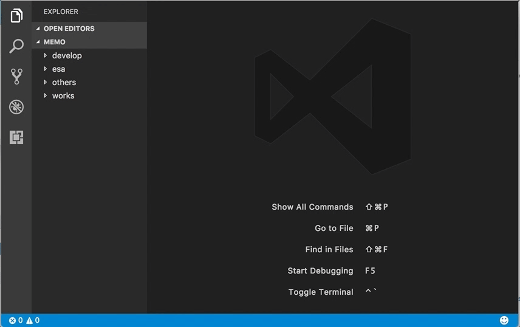
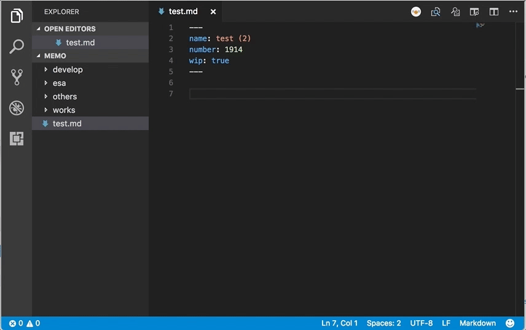
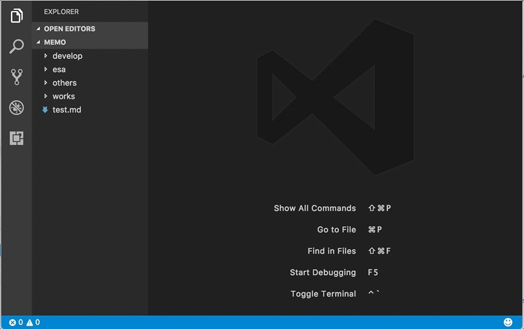

# vscode-esa README

This is the README for your extension "vscode-esa".

## Features

- Post a new post

- Edit an existing article

- Open an existing article

## Extension Settings

IMPORTANT: Please read this carefully before you start using the extension.

Open your user setting by Preferences: Open User Settings, and copy & paste token info to (Search esa to get you there):

- esa.token: your token
- esa.teamName: your team name
- esa.myName : your screen name

`──=≡=͟͟͞͞(\( ⁰⊖⁰)/)` **Enjoy!**